<h1 align="center">
Bored And Bookless
</h1>

             

#
<h1 align="center">
Uvod
</h1>

Bored And Bookless je Web aplikacije namenjena ljubiteljima knjiga. Aplikaciju mogu koristiti registrovani kao i ne registrovani korisnici (za pregled osnovnog sadržaja). Pored pregleda, izmene i brisanja sadržaja, registrovanim korisnicima je pružena mogućnost iznajmljivanja knjiga. 

#
<h1 align="center">
Početna stranica aplikacije
</h1>

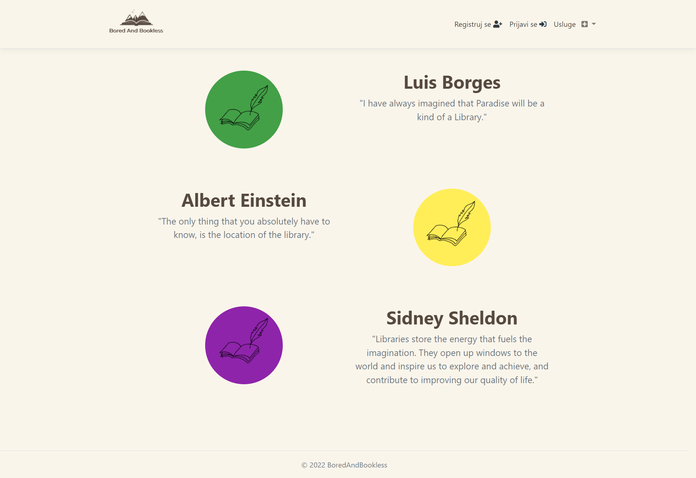

#
<h1 align="center">
Kontakt
</h1>

Stranici _Kontakt_ mogu da pristupe kako registrovani korisnici, tako i posetioci aplikacije. Na ovoj stranici nalaze se kontakt podaci našeg portala.

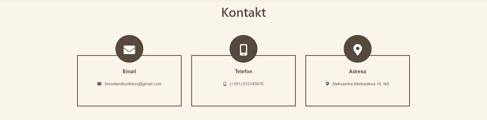

#
<h1 align="center">
Prijavljivanje korisnika
</h1>

Ukoliko je korisnik registrovan, on može da se prijavi, u suprotnom se tretira kao posetilac i ima pristup samo osnovnom sadržaju.

<h2 align="center">
Registracija novog korisnika
</h2>

1. U navigacionom baru klikom na dugme _Registruj se_ korisnik se preusmerava na stranicu za registraciju.
2. Na ovoj stranici se nalazi forma sa poljima (ime, prezime, email adresa, broj telefona, korisničko ime, lozinka) koja korisnik mora obavezno da popuni kako bi se uspešno registrovao.
3. Ukoliko korisnik ima nalog na kraju forme se nalazi link _Već imaš nalog?_ koji ga vodi na stranicu za prijavu.
4. Nakon klika na dugme _Registruj se_, ukoliko sve bude bilo u redu, korisnik biva registrovan i njegovi podaci se pamte u bazi podataka, ukoliko se javi greška prilikom registracije npr uneto korisničko ime već postoji, korisnik dobija odgovarajuću poruku o grešci.

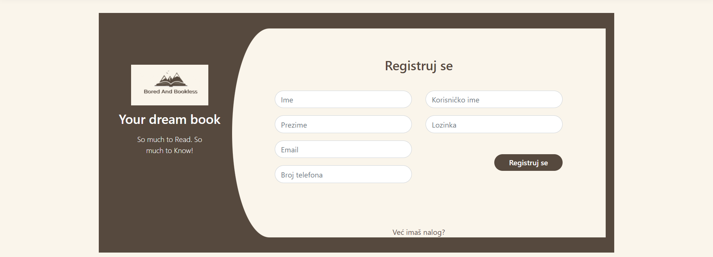

<h2 align="center">
Prijava prethodno registrovanog korisnika
</h2>

1. U navigacionom baru klikom na dugme _Prijavi se_ korisnik se preusmerava na stranicu za registraciju.
2. Na ovoj stranici se nalazi forma sa poljima (korisničko ime i lozinka) koja korisnik mora obavezno da popuni kako bi se uspesno prijavio.
3. Ukoliko korisnik nema nalog na kraju forme se nalazi link _Registruj se_ koji ga vodi na stranicu za registraciju.
4. Nakon klika na dugme _Prijavi se_, ukoliko sve bude bilo u redu, korisnik biva prijavljen na aplikaciju, ukoliko se javi greška prilikom prijavljivanja npr pogrešno korisničko ime ili lozinka, korisnik dobija odgovarajucu poruku o grešci.

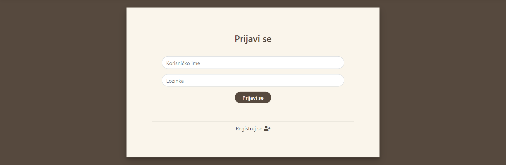

#
<h1 align="center">
Biblioteke
</h1>

Stranica _Biblioteke_ prikazuje korisniku sve biblioteke koje se nalaze u sistemu. Da bi se olakšalo pronalaženje željene biblioteke omogućeno je filtriranje biblioteka po gradu u kome se nalaze. 

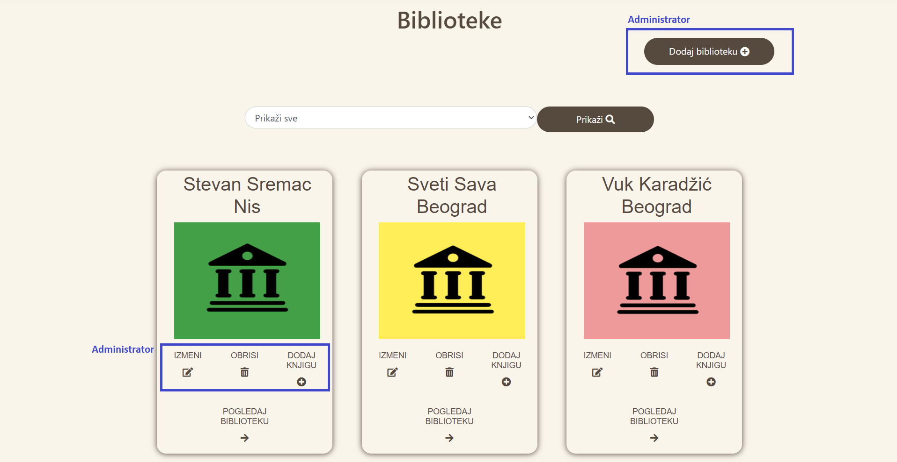

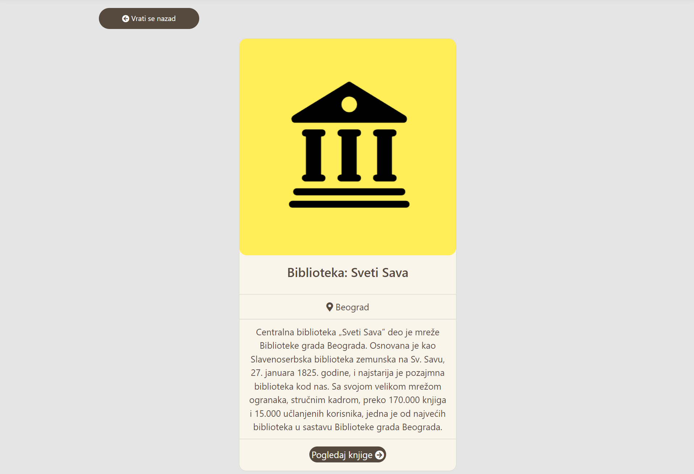

<h2 align="center">
Dodavanje nove biblioteke (funkcija administratora)
</h2>

1. U navigacionom baru klikom na dugme  _Usluge_ -> _Biblioteke_ administrator se preusmerava na stranicu sa bibliotekama. Na ovoj stranici se nalazi link _Dodaj biblioteku_ koji administratora vodi na stranicu za dodavanje nove biblioteke.
2. Na ovoj stranici se nalazi forma sa poljima (naziv, opis, grad i slika (slike se nalaze na lokaciji BoredAndBookless\wwwroot\images)) koja administrator mora obavezno da popuni kako bi uspešno dodao novu biblioteku.
3. Nakon klika na dugme _Dodaj novu biblioteku_, ukoliko sve bude bilo u redu, nova biblioteka se dodaje i njeni podaci se pamte u bazi podataka, ukoliko se javi greška prilikom dodavanja npr već postoji biblioteka sa tim nazivom, administrator dobija odgovarajuću poruku o grešci.

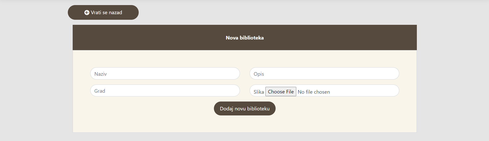

<h2 align="center">
Izmena biblioteke (funkcija administratora)
</h2>

1. Na stranici sa bibliotekama u kartici odgovarajuće biblioteke se nalazi dugme _Izmeni_ koje administratora preusmerava na stranicu za izmenu biblioteke.
2. Na ovoj stranici se nalazi forma sa poljima (naziv, opis, grad) koja administrator moze da izmeni.
3. Nakon klika na dugme _Sačuvaj izmene_, vrši se izmena biblioteke i njeni podaci se ažuriraju u bazi podataka.

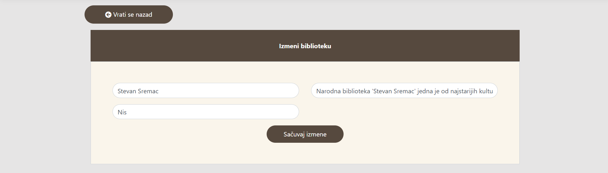

<h2 align="center">
Brisanje biblioteke (funkcija administratora)
</h2>

1. Na stranici sa bibliotekama u kartici odgovarajuće biblioteke se nalazi dugme _Obriši_ koje administratora preusmerava na stranicu za brisanje biblioteke.
2. Ukoliko biblioteka sadrži knjige onda je nemoguće brisanje te biblioteke, administrator dobija odgovarajuću poruku o grešci.
3. Nakon klika na dugme _Da_, vrši se brisanje biblioteke.

#
<h1 align="center">
Knjige
</h1>

Stranica _Knjige_ prikazuje korisniku sve knjige koje se nalaze u izabranoj biblioteci. Da bi se olakšalo pronalaženje željene knjige omogućeno je filtriranje po žanru.

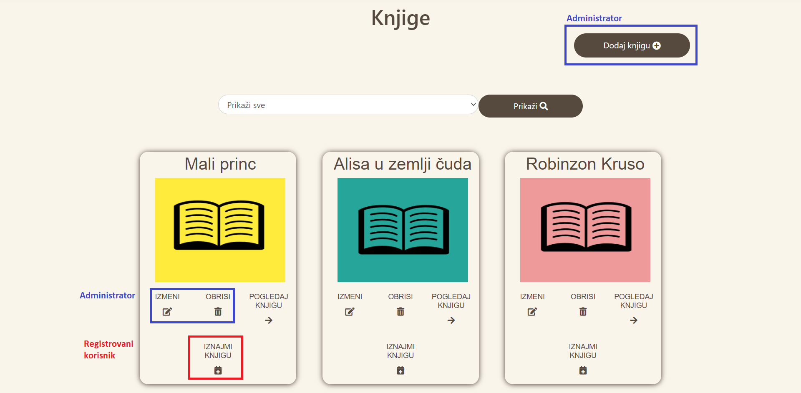

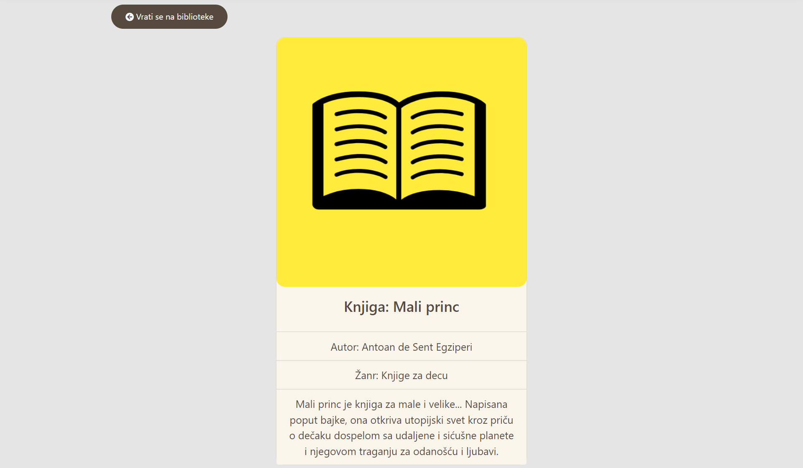

<h2 align="center">
Dodavanje nove knjige (funkcija administratora)
</h2>

1. U navigacionom baru klikom na dugme  _Usluge_ -> _Biblioteke_ administrator se preusmerava na stranicu sa bibliotekama. Na ovoj stranici u kartici odgovarajuce biblioteke se nalazi link _Dodaj knjigu_ koji administratora vodi na stranicu za dodavanje nove knjige.
2. Na ovoj stranici se nalazi forma sa poljima (naziv, autor, žanr, opis i slika (slike se nalaze na lokaciji BoredAndBookless\wwwroot\images)) koja administrator mora obavezno da popuni kako bi uspešno dodao novu knjigu.
3. Nakon klika na dugme _Dodaj novu knjigu_, ukoliko sve bude bilo u redu, nova knjiga se dodaje i njeni podaci se pamte u bazi podataka, ukoliko se javi greška prilikom dodavanja npr već postoji knjiga sa tim nazivom, administrator dobija odgovarajuću poruku o grešci.

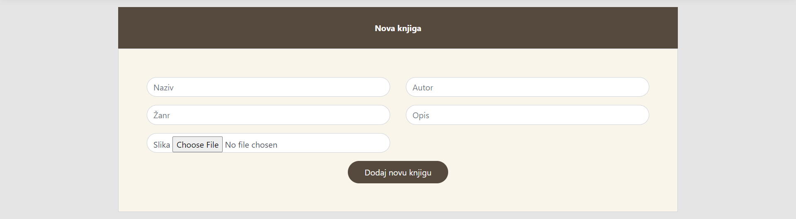

<h2 align="center">
Izmena knjige (funkcija administratora)
</h2>

1. Na stranici sa knjigama u kartici odgovarajuce knjige se nalazi dugme _Izmeni_ koje administratora preusmerava na stranicu za izmenu knjige.
2. Na ovoj stranici se nalazi forma sa poljima (naziv,autor, žanr i opis) koja administrator moze da izmeni.
3. Nakon klika na dugme _Sačuvaj izmene_, vrši se izmena knjige i njeni podaci se ažuriraju u bazi podataka.

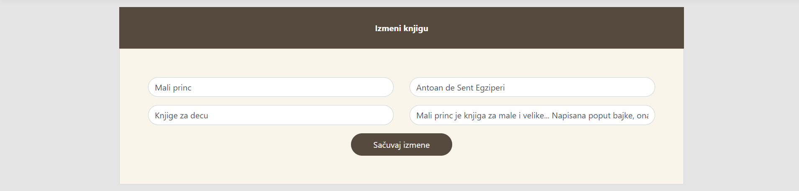

<h2 align="center">
Brisanje knjige (funkcija administratora)
</h2>

1. Na stranici sa knjigama u kartici odgovarajuće knjige se nalazi dugme _Obriši_ koje administratora preusmerava na stranicu za brisanje knjige.
2. Ukoliko je knjiga iznajmljena onda je nemoguće brisanje te knjige, administrator dobija odgovarajuću poruku o grešci.
3. Nakon klika na dugme _Da_, vrši se brisanje knjige.

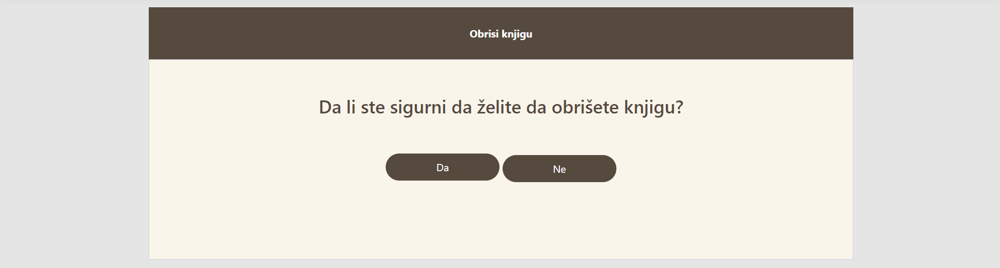

#
<h1 align="center">
Iznajmljivanje knjige
</h1>

<h2 align="center">
Iznajmljivanje knjige (funkcija registrovanog korisnika)
</h2>

1. Na stranici sa knjigama u kartici odgovarajuce knjige se nalazi dugme _Iznajmi knjigu_ koje korisnika preusmerava na stranicu za iznajmljivanje knjige.
2. Na ovoj stranici se nalazi forma sa poljima (datum iznajmljivanja i datum vraćanja) koja korisnik mora obavezno da popuni kako bi uspešno iznajmio knjigu.
3. Nakon klika na dugme _Iznajmi knjigu_, ukoliko sve bude bilo u redu knjiga se uspesno iznajmljuje, ukoliko se javi neka greška korisnik dobija odgovarajuću poruku.

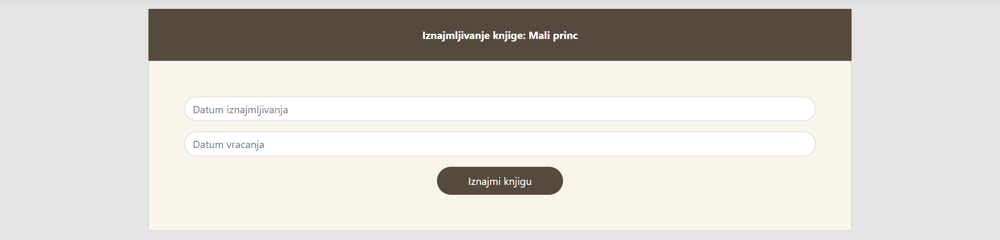

<h2 align="center">
Tabela iznajmljenih knjiga (pogled administratora)
</h2>

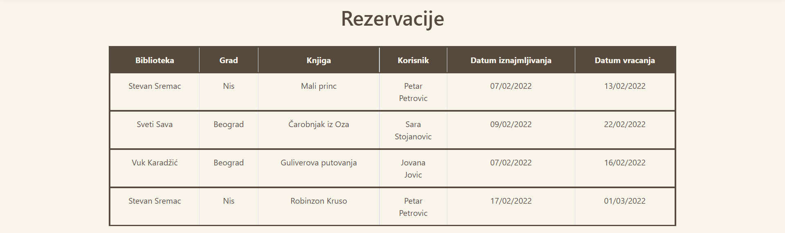

<h2 align="center">
Tabela iznajmljenih knjiga (pogled registrovanog korisnika)
</h2>

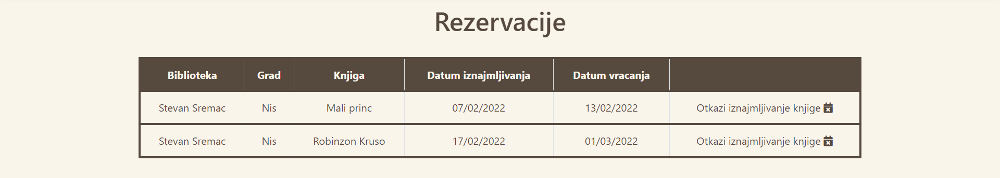

<h2 align="center">
Otkazivanje iznajmljivanja knjige (funkcija registrovanog korisnika)
</h2>

1. Na stranici sa rezervacijama u redu odgovarajuce knjige se nalazi link _Otkaži iznajmljivanje knjige_ koji administratora preusmerava na stranicu za otkazivanje iznajmljivanja knjige.
2. Nakon klika na dugme _Da_, vrši se otkazivanje iznajmljivanja knjige.

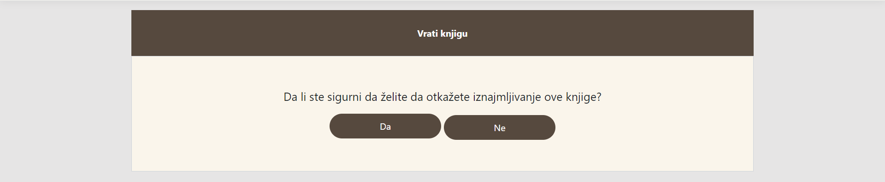

#
<h1 align="center">
Moj Profil (funkcija registrovanog korisnika)
</h1>

Registrovan korisnik, nakon što se prijavi na aplikaciju iz navigacionog bara može da pristupi svom profilu klikom na dugme _Profil_. Preusmerava se na stranicu koja sadrži formu sa opštim podacima korisnika.

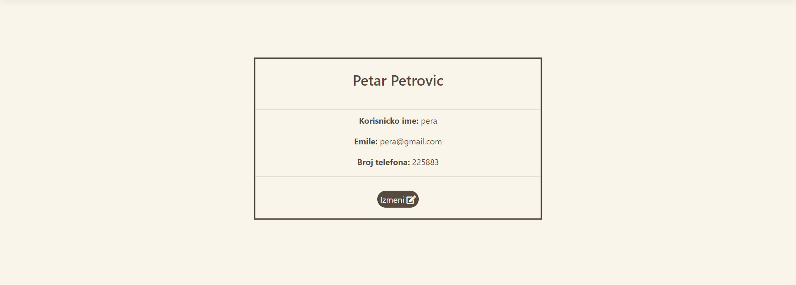

<h2 align="center">
Izmena profila (funkcija registrovanog korisnika)
</h2>

1. Na stranici profila nalazi se dugme _Izmeni_ koje korisnika preusmerava na stranicu za izmenu profila.
2. Na ovoj stranici se nalazi forma sa poljima (ime, prezime, email adresa, broj telefona, korisničko ime i lozinka) koja korisnik može da izmeni.
3. Nakon klika na dugme _Sačuvaj izmene_, vrši se izmena podataka korisnika i azuriranje u bazi podataka.

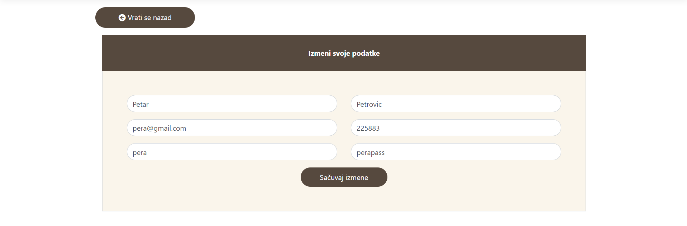

