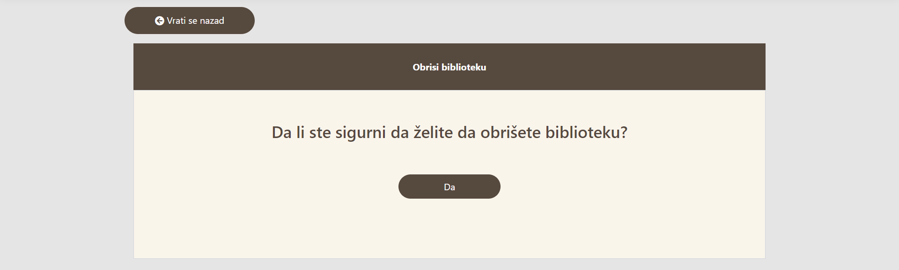

<h1 align="center">
Bored And Bookless
</h1>

             

#
<h1 align="center">
Uvod
</h1>

Bored And Bookless je Web aplikacije namenjena ljubiteljima knjiga. Aplikaciju mogu koristiti registrovani kao i ne registrovani korisnici (za pregled osnovnog sadrzaja). Pored pregleda, izmene i brisanja sadrzaja, registrovanim korisnicima je pruzena mogucnost iznajmljivanja knjiga. 

#
<h1 align="center">
Početna stranica aplikacije
</h1>

#
<h1 align="center">
Kontakt
</h1>

Stranici _Kontakt_ mogu da pristupe kako registrovani korisnici, tako i posetioci aplikacije. Na ovoj stranici nalaze se kontakt podaci naseg portala.

#
<h1 align="center">
Prijavljivanje korisnika
</h1>

Ukoliko je korisnik registrovan, on moze da se prijavi, u suprotnom se tretira kao posetilac i ima pristup samo osnovnom sadrzaju.

<h2 align="center">
Registracija novog korisnika
</h2>

1. U navigacionom baru klikom na dugme _Registruj se_ korisnik se preusmerava na stranicu za registraciju.
2. Na ovoj stranici se nalazi forma sa poljima (ime, prezime, email adresa, broj telefona, korisnicko ime, lozinka) koja korisnik mora obavezno da popuni kako bi se uspesno registrovao.
3. Ukoliko korisnik ima nalog na kraju forme se nalazi link _Već imaš nalog?_ koji ga vodi na stranicu za prijavu.
4. Nakon klika na dugme _Registruj se_, ukoliko sve bude bilo u redu, korisnik biva registrovan i njegovi podaci se pamte u bazi podataka, ukoliko se javi greska prilikom registracije npr uneto korisnicko ime vec postoji, korisnik dobija odgovarajucu poruku o gresci.

<h2 align="center">
Prijava prethodno registrovanog korisnika
</h2>

1. U navigacionom baru klikom na dugme _Prijavi se_ korisnik se preusmerava na stranicu za registraciju.
2. Na ovoj stranici se nalazi forma sa poljima (korisnicko ime i lozinka) koja korisnik mora obavezno da popuni kako bi se uspesno prijavio.
3. Ukoliko korisnik nema nalog na kraju forme se nalazi link _Registruj se_ koji ga vodi na stranicu za registraciju.
4. Nakon klika na dugme _Prijavi se_, ukoliko sve bude bilo u redu, korisnik biva prijavljen na aplikaciju, ukoliko se javi greska prilikom prijavljivanja npr pogresno korisnicko ime ili lozinka, korisnik dobija odgovarajucu poruku o gresci.

#
<h1 align="center">
Biblioteke
</h1>

Stranica _Biblioteke_ prikazuje korisniku sve biblioteke koje se nalaze u sistemu. Da bi se olaksalo pronalazenje zeljene biblioteke omoguceno je filtriranje biblioteka po gradu u kome se nalaze. 

<h2 align="center">
Dodavanje nove biblioteke (funkcija administratora)
</h2>

1. U navigacionom baru klikom na dugme  _Usluge_ -> _Biblioteke_ administrator se preusmerava na stranicu sa bibliotekama. Na ovoj stranici se nalazi link _Dodaj biblioteku_ koji administratora vodi na stranicu za dodavanje nove biblioteke.
2. Na ovoj stranici se nalazi forma sa poljima (naziv, opis, grad i slika (slike se nalaze na lokaciji BoredAndBookless\wwwroot\images)) koja administrator mora obavezno da popuni kako bi se uspesno dodao novu biblioteku.
3. Nakon klika na dugme _Dodaj novu biblioteku_, ukoliko sve bude bilo u redu, nova biblioteka se dodaje i njeni podaci se pamte u bazi podataka, ukoliko se javi greska prilikom dodavanja npr vec postoji biblioteka sa tim nazivom, administrator dobija odgovarajucu poruku o gresci.

<h2 align="center">
Izmena biblioteke (funkcija administratora)
</h2>

1. Na stranici sa bibliotekama u kartici odgovarajuce biblioteke se nalazi dugme _Izmeni_ koje administratora preusmerava na stranicu za izmenu biblioteke.
2. Na ovoj stranici se nalazi forma sa poljima (naziv, opis, grad) koja administrator moze da izmeni.
3. Nakon klika na dugme _Sacuvaj izmene_, vrsi se izmena biblioteke i njeni podaci se azuriraju u bazi podataka.

<h2 align="center">
Brisanje biblioteke (funkcija administratora)
</h2>

1. Na stranici sa bibliotekama u kartici odgovarajuce biblioteke se nalazi dugme _Obrisi_ koje administratora preusmerava na stranicu za brisanje biblioteke.
2. Ukoliko biblioteka sadrzi knjige onda je nemoguce brisanje te biblioteke, administrator dobija odgovarajucu poruku o gresci.
3. Nakon klika na dugme _Da_, vrsi se brisanje biblioteke.

#
<h1 align="center">
Knjige
</h1>

Stranica _Knjige_ prikazuje korisniku sve knjige koje se nalaze u izabranoj biblioteci. Da bi se olaksalo pronalazenje zeljene knjige omoguceno je filtriranje po zanru.

<h2 align="center">
Dodavanje nove knjige (funkcija administratora)
</h2>

1. U navigacionom baru klikom na dugme  _Usluge_ -> _Biblioteke_ administrator se preusmerava na stranicu sa bibliotekama. Na ovoj stranici u kartici odgovarajuce biblioteke se nalazi link _Dodaj knjigu_ koji administratora vodi na stranicu za dodavanje nove knjige.
2. Na ovoj stranici se nalazi forma sa poljima (naziv, autor, zanr, opis i slika (slike se nalaze na lokaciji BoredAndBookless\wwwroot\images)) koja administrator mora obavezno da popuni kako bi se uspesno dodao novu knjigu.
3. Nakon klika na dugme _Dodaj novu knjigu_, ukoliko sve bude bilo u redu, nova knjiga se dodaje i njeni podaci se pamte u bazi podataka, ukoliko se javi greska prilikom dodavanja npr vec postoji knjiga sa tim nazivom, administrator dobija odgovarajucu poruku o gresci.

<h2 align="center">
Izmena knjige (funkcija administratora)
</h2>

1. Na stranici sa knjigama u kartici odgovarajuce knjige se nalazi dugme _Izmeni_ koje administratora preusmerava na stranicu za izmenu knjige.
2. Na ovoj stranici se nalazi forma sa poljima (naziv,autor, zanr i opis) koja administrator moze da izmeni.
3. Nakon klika na dugme _Sacuvaj izmene_, vrsi se izmena knjige i njeni podaci se azuriraju u bazi podataka.

<h2 align="center">
Brisanje knjige (funkcija administratora)
</h2>

1. Na stranici sa knjigama u kartici odgovarajuce knjige se nalazi dugme _Obrisi_ koje administratora preusmerava na stranicu za brisanje knjige.
2. Ukoliko je knjiga iznajmljena onda je nemoguce brisanje te knjige, administrator dobija odgovarajucu poruku o gresci.
3. Nakon klika na dugme _Da_, vrsi se brisanje knjige.

#
<h1 align="center">
Iznajmljivanje knjige
</h1>

<h2 align="center">
Iznajmljivanje knjige (funkcija registrovanog korisnika)
</h2>

1. Na stranici sa knjigama u kartici odgovarajuce knjige se nalazi dugme _Iznajmi knjigu_ koje korisnika preusmerava na stranicu za iznajmljivanje knjige knjige.
2. Na ovoj stranici se nalazi forma sa poljima (datum iznajmljivanja i datum vracanja) koja korisnik mora obavezno da popuni kako bi uspesno iznajmio knjigu.
3. Nakon klika na dugme _Iznajmi knjigu_, ukoliko sve bude bilo u redu knjiga se uspesno iznajmljuje, ukoliko se javi neka greska korisnik dobija odgovarajucu poruku.

<h2 align="center">
Tabela iznajmljenih knjiga (pogled administratora)
</h2>

<h2 align="center">
Tabela iznajmljenih knjiga (pogled registrovanog korisnika)
</h2>

<h2 align="center">
Otkazivanje iznajmljivanja knjige (funkcija registrovanog korisnika)
</h2>

1. Na stranici sa rezervacijama u redu odgovarajuce knjige se nalazi link _Otkazi iznajmljivanje knjige_ koji administratora preusmerava na stranicu za otkazivanje iznajmljivanja knjige.
2. Nakon klika na dugme _Da_, vrsi se otkazivanje iznajmljivanja knjige.

#
<h1 align="center">
Moj Profil (funkcija registrovanog korisnika)
</h1>

Registrovan korisnik, nakon sto se prijavi na aplikaciju iz navigacionog bara, moze da pristupi svom profilu klikom na dugme _Profil_. Preusmerava se na stranicu koja sadrzi formu sa opstim podacima korisnika.

<h2 align="center">
Izmena profila (funkcija registrovanog korisnika)
</h2>

1. Na stranici profila nalazi se dugme _Izmeni_ koje korisnika preusmerava na stranicu za izmenu profila.
2. Na ovoj stranici se nalazi forma sa poljima (ime, prezime, email adresa, broj telefona, korisnicko ime i lozinka) koja korisnik moze da izmeni.
3. Nakon klika na dugme _Sacuvaj izmene_, vrsi se izmena podataka korisnika i azuriranje u bazi podataka.

